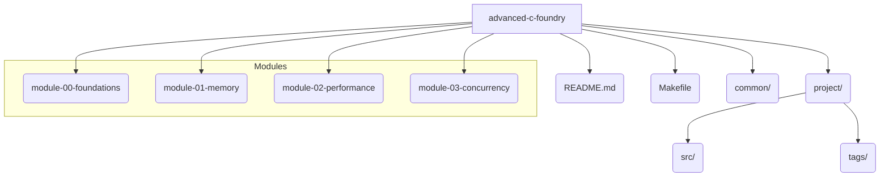

# Advanced C Foundry

A hands-on workbench for learning advanced C programming concepts, from memory management to concurrency, based on the plan developed by the R&D Council.

This repository is designed to be an owner's companion for a structured, practical journey into mastering advanced C. It follows an iterative approach, building skills from the ground up and applying them to a progressively evolving project.

## 📚 Documentation

A comprehensive documentation bundle for this project is maintained on Google Drive. It includes a detailed project overview, learning roadmaps, and supporting references.

*   **[Main Documentation Bundle](https://docs.google.com/document/d/1sgZH7SbIR7PrG_eSzrAcOHb_OGaEHtgSJAOfLl2yH6Q/edit?usp=drivesdk)**
*   **[Project Drive Folder](https://drive.google.com/drive/folders/1GQNxMph7sPwFbcI5lgWFLaAnH0xeFGDp)**

## Learning Path

The learning path is divided into four modules, each tackling a specific area of advanced C. You must follow them in order.

1.  **Module 00: Foundations** - Solidify your understanding of pointers, memory layout, and the compilation process.
2.  **Module 01: Advanced Memory Management** - Learn to debug memory issues with Valgrind and implement a custom arena allocator.
3.  **Module 02: Performance & Profiling** - Profile C code to find bottlenecks and understand the impact of compiler optimizations.
4.  **Module 03: Concurrency** - Introduce multi-threading with Pthreads and learn to protect shared data with mutexes.

## Repository Structure

## Required Tooling

To complete the exercises in this repository, you will need the following tools on an `x8d64 Linux` system:

*   `gcc` (C11)
*   `make`
*   `gdb`
*   `valgrind`
*   `gprof` or `perf`

All code should be compiled with `-Wall -Wextra -Werror` to ensure high code quality.
