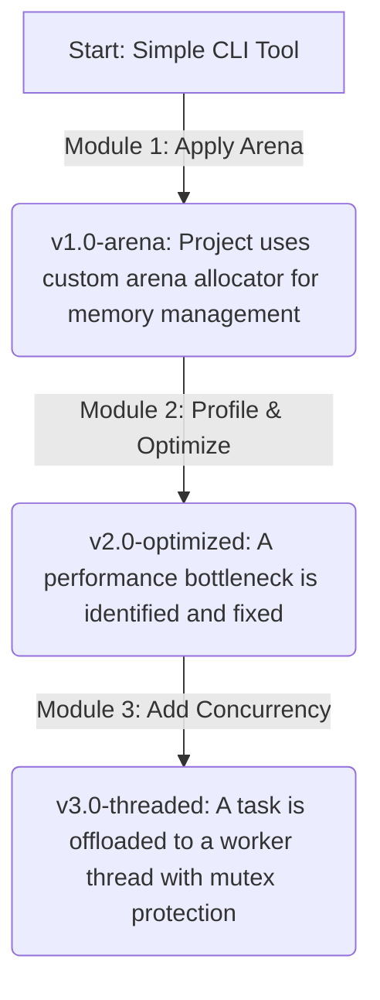

# Architecture

This document outlines the high-level architecture and learning progression of the `advanced-c-foundry` repository.

The design philosophy is **iterative and incremental complexity**. We start with foundational concepts and apply each new advanced skill to an evolving project. This ensures that each concept is learned in a practical context without overwhelming the learner.

## Project Evolution Flow

The central `project` evolves as the learner completes each module. Git tags are used to mark the state of the project after each significant upgrade.

This flow provides a clear, manageable path for applying theoretical knowledge to a practical codebase, transforming a simple tool into a robust, multi-threaded application piece by piece.
